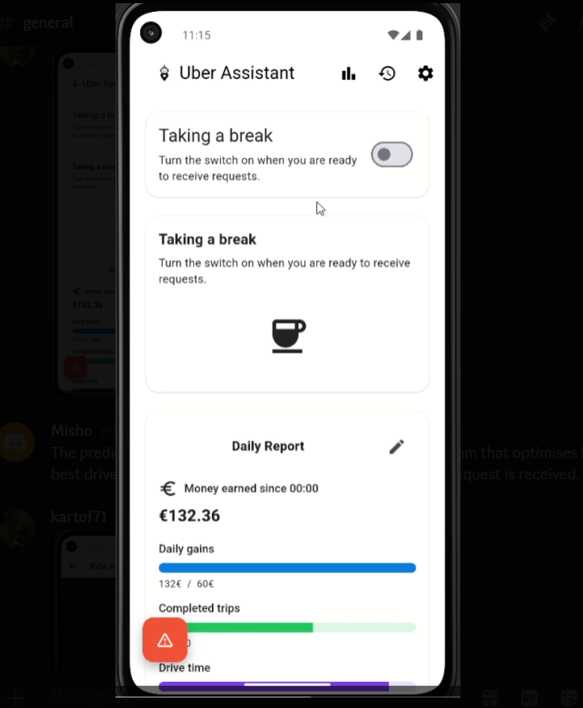
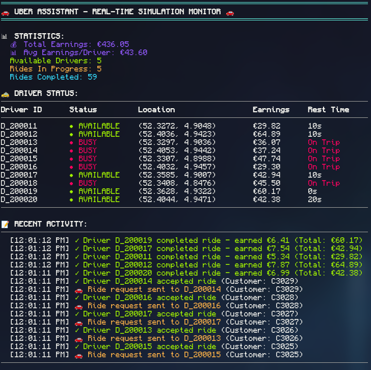

# Uber Assistant
[JunctionX Delft Hackathon - The Cucumbers](https://eu.junctionplatform.com/projects/junctionx-delft/view/68e22ff2caba096fa9fb405a)

The Uber Assistant that optimizes routes, rewards, and rest, helps drivers earn smarter and drive healthier. By combining data-driven insights with personalized guidance, it transforms driving from reactive to strategic, improving safety, satisfaction, and retention across Uber’s network.
## It consists of 3 parts
### Frontend
The frontend is made on Flutter to ensure cross-platform compatibility. It includes many features, like smart request advice, personal statistics, and an activity heatmap.

### Backend
Our backend is a NodeJs server to facilitate communication between the data and the client. It also communicates with the machine learning model to obtain advice on different ride requests.

A visual simulation with drivers and requests was created on the backend and utilized to test the performance of the drivers using our model's advice.

### Machine learning model
The machine learning model is a genetic algorithm that generates strategies for drivers. The strategies decide which requests to take, so that the driver maximises money while having enough breaks and keeping the journeys comfortable. Things like cost of the journey, weather patterns, cancellation rates, distances and others have been taken into account to achieve data-driven decisions.

The algorithm optimizes goodness function that evaluates requests so that a decision is made whether to take the request or no based on the expected requests for the day.
